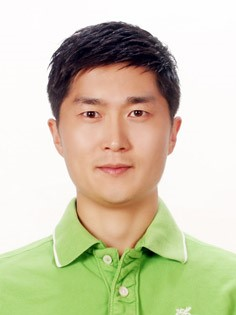

:page-layout: default
:page-permalink: /
= Home
:uri-mcgill: https://www.mcgill.ca/
:uri-mime: http://www.mcgill.ca/minmat/

[cols="x,2x", options="none"]
|===

|

|
*Brief Overview* +
I am a postdoctoral fellow working on computational thermodynamics. I have expertise in thermodynamic modeling and phase diagram experiments. Currently I am interested in learning Python to enhance my research capacity.

{uri-mime}[Department of Mining and Materials Engineering] +
{uri-mcgill}[McGill University] +
Wong Building Rm#2260 +
3610 University Street +
Montreal, QC, H3A 0C5 Canada +

|===

=== *Research Interests*
- Optimization of pyrometallurgical processes +
- Extraction of valuable materials from industrial by-products & development of novel recycling processes +
- Process optimizations related to glass-ceramics & biofuel & fertilizer makings +

=== *Expertise in Computational Thermodynamics* +
- Simulation and optimization of pyrometallurgical processes +
- Developing thermodynamic databases related to steelmaking, glassmaking, ceramics, and biofuel research +

=== *Personal Development Projects using Python* +
- Automation of data extraction from text & image files and webpages +
- Optimization of process parameters using machine learning algorithms +
